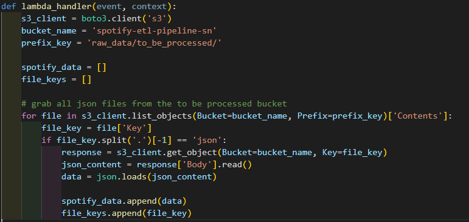
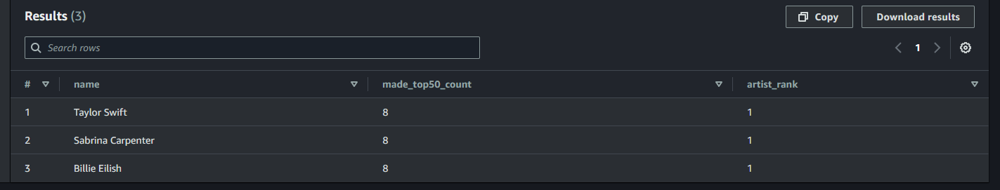
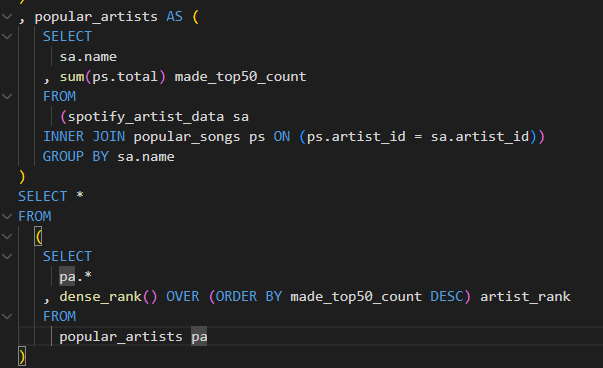

# Spotify Serverless ETL Pipeline

Welcome to the Spotify Serverless ETL Pipeline project! This project demonstrates the creation of a fully serverless data pipeline using AWS services and Python to process Spotify's top 50 playlists data. It showcases data engineering skills, efficient architecture design, and future scalability potential for data analytics or AI model training.

[View Detailed Project Demo Video](https://saadnasir92.github.io/Spotify-Serverless-ETL-Pipeline-Engineering-with-AWS/)

## Table of Contents

- [Project Overview](#project-overview)
- [Architecture](#architecture)
- [Data Processing and Storage](#data-processing-and-storage)
- [Data Analytics with Amazon Athena](#data-analytics-with-amazon-athena)
- [Impact and Future Potential](#impact-and-future-potential)
- [Screenshots](#screenshots)

## Project Overview

The Spotify Serverless ETL Pipeline is designed to automate the extraction, transformation, and analysis of data from Spotify's top 50 playlists. By leveraging AWS services such as Lambda, S3, Glue, and Athena, the pipeline efficiently processes and organizes music data, providing immediate insights without manual intervention.

### Key Features

- **Serverless Architecture**: Utilizes AWS Lambda and other serverless technologies for efficient and scalable data processing.
- **Automated Data Processing**: Extracts, transforms, and loads (ETL) data daily from Spotify's API, storing it in Amazon S3.
- **Data Analytics**: Enables querying and analysis using Amazon Athena, providing quick insights into music trends.
- **Future Scalability**: Designed with flexibility in mind, allowing for future integration with BI tools, AI models, and more.

## Architecture

The pipeline architecture is built entirely on AWS, leveraging its serverless offerings to create a scalable and efficient ETL process. Below is a high-level overview of the architecture:

- **Data Extraction**: AWS Lambda functions, triggered by CloudWatch Events, pull data from Spotify's API, capturing details about the top 50 playlists, including songs, albums, and artists.
- **Data Transformation**: Python scripts within the Lambda environment transform the extracted data, preparing it for storage.
- **Data Storage**: Transformed data is stored in Amazon S3 as CSV files, acting as the central data repository.
- **Data Cataloging**: AWS Glue Crawlers automatically catalog the stored data, creating a schema for querying.
- **Data Analysis**: Amazon Athena provides an SQL interface for querying and analyzing the data, allowing for dynamic insights into Spotify's music trends.

*Figure 1: Pipeline architecture from data collection to analytics.*

## Data Processing and Storage

The pipeline's data processing logic ensures accurate and efficient handling of Spotify's top 50 playlists data:

- **Data Extraction**: The pipeline automatically extracts the top 50 playlists daily using AWS Lambda, capturing relevant metadata for songs, albums, and artists.
- **Data Transformation**: Python scripts transform the extracted data, cleaning and structuring it for analysis.
- **Data Storage**: Transformed data is stored in Amazon S3 as CSV files, providing a centralized and scalable data repository.

## Data Analytics with Amazon Athena

Amazon Athena plays a crucial role in the pipeline by enabling quick and efficient data analysis:

- **SQL Querying**: Athena allows users to run SQL queries directly on the data stored in S3, providing immediate access to insights.
- **Business Insights**: Users can analyze trends, artist performance, and more, without needing extensive infrastructure.
- **Future Possibilities**: The pipeline is poised for future enhancements, such as integration with BI tools for dashboards or AI models for predictive analytics.

## Impact and Future Potential

The Spotify Serverless ETL Pipeline offers significant benefits and sets the stage for future development:

- **Efficient Data Processing**: Automates data handling, reducing manual labor and ensuring data accuracy.
- **Scalability**: Serverless architecture provides scalability, allowing the pipeline to adapt to various analytical needs.
- **Future Enhancements**: Potential for integration with BI tools, AI models, and additional AWS services for expanded analytics capabilities.

## Screenshots

Here are some screenshots demonstrating the key components of the project:

*Figure 4: Sample transformation logic deployed on AWS Lambda.*

*Figure 2: Querying top 3 artists ranked by appearances in the Spotify Daily Top 50 Playlist with Amazon Athena for fast and actionable insights.*
